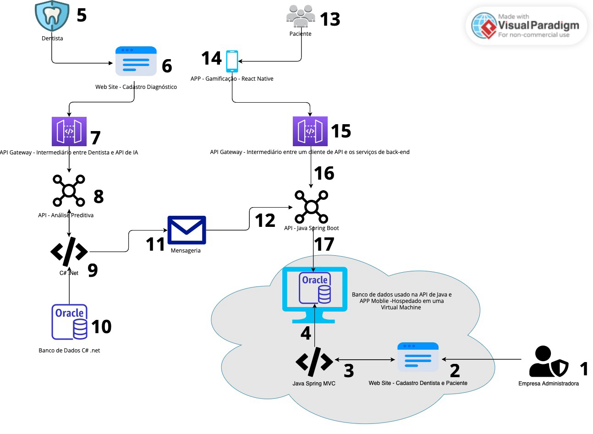
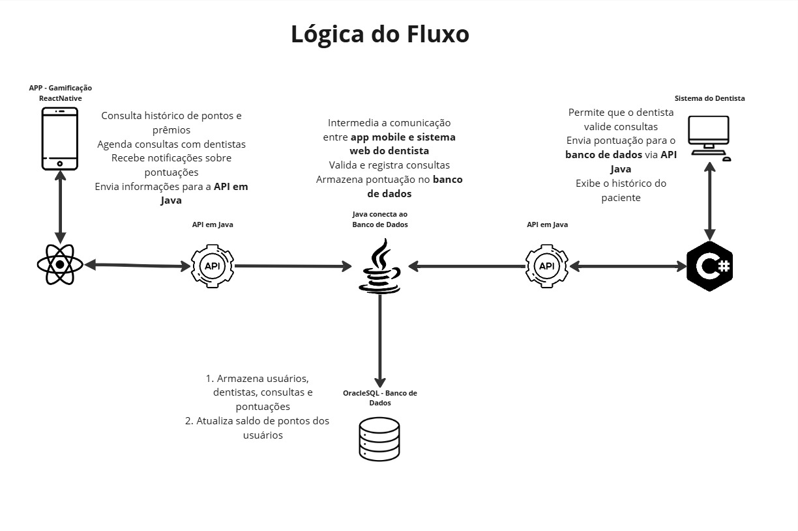
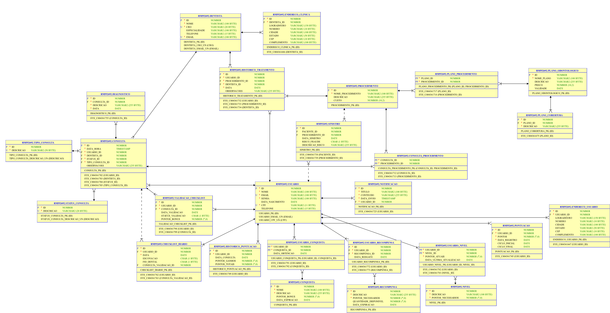
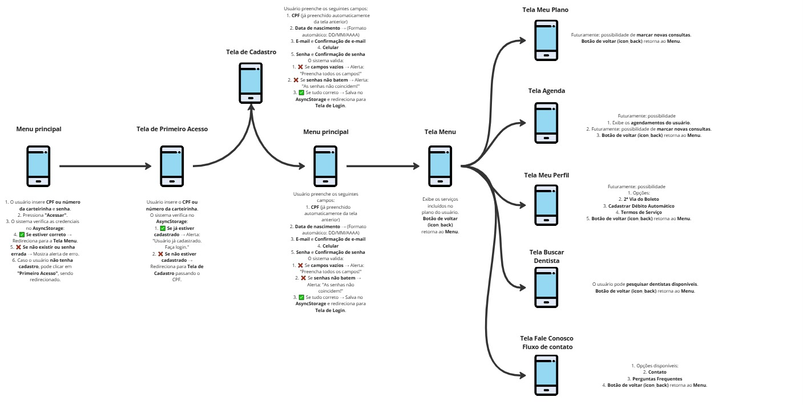

# 🦷 OdontoVision

--

## 📌 Link
**MIRO IDEIAS E ORGANIZAÇÃO:** [Clique aqui para acessar o board](https://miro.com/app/board/uXjVLwX7Ul0=/?share_link_id=229877203937)

--

## 👨‍💻 Equipe de Desenvolvimento

| Nome              | RM       |
|-------------------|----------|
| Luis Henrique     | RM552692 |
| Sabrina Café      | RM553568 |
| Matheus Duarte    | RM554199 |

---

## 📱 Sobre o Projeto

**OdontoVision** é um aplicativo mobile desenvolvido em **React Native**, com o objetivo de facilitar e otimizar a experiência dos usuários da **OdontoPrev** no gerenciamento de suas consultas odontológicas. 

A proposta do app é criar uma ponte entre **clientes e dentistas**, incentivando a **prevenção odontológica** por meio de **gamificação** e um sistema de **recompensas**.

---

## 🎯 Objetivo

O aplicativo visa **incentivar consultas preventivas** e fortalecer a relação entre **pacientes e profissionais de odontologia**, reduzindo o número de sinistros graves e prevenindo **fraudes** no uso do convênio odontológico.

---

## 👥 Usuários e Perfis

- **🧑‍💼 Clientes OdontoPrev:**  
  - Convêniados com perfis individuais para acompanhar **agendamentos, pontuações e benefícios**.

- **🦷 Dentistas (via sistema web):**  
  - Profissionais credenciados que validam consultas e atribuem pontos aos pacientes.

---

## 🧩 Funcionalidades Principais

### 📲 Para Clientes
- ✅ Agendar consultas e preventivas  
- ✅ Acompanhar histórico de atendimentos  
- ✅ Acumular pontos por presença e bom desempenho  
- ✅ Trocar pontos por recompensas  
- ✅ Verificar disponibilidade de dentistas  
- ✅ Receber notificações sobre consultas e pontuações  
- ✅ Gerenciar seu perfil

### 💻 Para Dentistas (via sistema web)
- ✅ Validar consultas realizadas  
- ✅ Atribuir pontos conforme critérios definidos  
- ✅ Visualizar histórico do paciente  
- ✅ Gerenciar conta profissional  
- ✅ Registrar novos usuários  
- ✅ Visualizar estatísticas gerais  

---

## 🚀 Tecnologias Utilizadas

- ⚛️ **React Native**  
- 📦 **Expo**  
- 🟦 **TypeScript**  
- 💾 **AsyncStorage** (armazenamento local TEMPORÁRIO - SP-3)  

---

## 📂 Arquitetura do Sistema

A estrutura do sistema é baseada na comunicação entre o **aplicativo mobile**, o **back-end Java (Spring Boot)** e o **sistema web do dentista (C#)**.

### 📌 **Fluxo Geral do Projeto**

### 🔄 **Lógica do Fluxo**

### 🗄️ **Banco de Dados Relacional**

### 📱 **Classes**

---

## 📌 Status do Projeto

🚧 **Em desenvolvimento...**

As funcionalidades de **autenticação, cadastro, navegação, sistema de pontos e integração com web** estão sendo desenvolvidas com foco na usabilidade e na experiência do usuário.

As funcionalidade de **Gamificação** serão entregues nas SP4 com todo projeto de envio e recebimento de recomepensas.

**📢 FOCO NA SPRINT 4!**  

